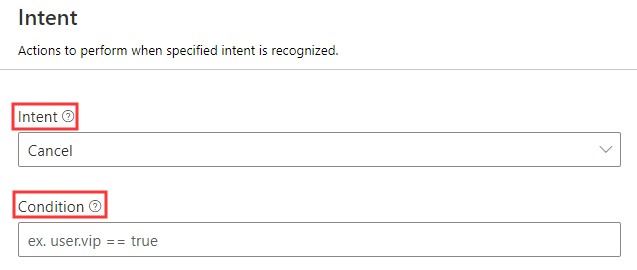

# Events and triggers
In Bot Framework Composer, each dialog includes a set of triggers (event handlers) that contain instructions for how the bot will respond to inputs received when the dialog is active. When a bot receives a message, an event of the type `activityReceived` is fired. As the message is processed by the recognizer and passes through the dialog system, other events of different types are fired. If an event handler is found to handle an incoming event, that event is considered handled, and processing of further event handlers stops. If no event handler is found, the event will pass through the bot with no additional actions taken. 

On the navigation pane, click **New Trigger** and you will see the trigger menu in Composer as follows: 

## Anatomy of a trigger
The basic idea behind a trigger (event handler) is "When (_event_) happens, then do (_actions_)". The trigger is a conditional test on an incoming event, while the actions are one or more programmatic steps the bot will take to fulfill the user's request. 

Every trigger contains the following components:
- A trigger name that can be changed in the property panel 
- Possible **Condition** (specified using [Common Language Expression](https://github.com/microsoft/BotBuilder-Samples/tree/master/experimental/common-expression-language)), must evaluate to be "true" for the event to fire
- Actions defined to fire when the event is triggered

The screenshot below shows the definition of an **Intent** trigger that is configured to fire whenever the "cancel" intent is detected. It is possible to add a condition to the event - this expression which follows [Common Language Expression](https://github.com/microsoft/BotBuilder-Samples/tree/master/experimental/common-expression-language)), if specified, must evaluate to be "true" for the event to fire. 

This event will appear in the dialog as a node at the top of the editor. Actions within this trigger occur in the context of the active dialog. These steps control the main functionality of a bot.

## Types of triggers 
There are different types of triggers. They all work in a similar manner, and in some cases, can be interchanged. This section will cover the different types of triggers and when should we use them. Read more to learn how to [define triggers](howto-defining-triggers.md). 

### Dialog trigger  
The base type of triggers are dialog triggers. Almost all events start as dialog events which are related to the "lifecycle" of the dialog. Currently there are four different dialog triggers in Composer: **Dialog started (BeginDialog)**, **Dialog cancelled (CancelDialog)**, **Error occurred** and **Re-prompt for input**. Most dialogs will include a trigger configured to respond to the `BeginDialog` event, which fires when the dialog begins and allows the bot to respond immediately. 

Use dialog triggers when you want to:
- Take actions immediately when the dialog starts, even before the recognizer is called
- Take actions when a "cancel" signal is detected
- Take automatic action on every message as it is received or sent
- Evaluate the raw content of the incoming activity

See how to define a dialog trigger [here](howto-defining-triggers.md#dialog-trigger).

### Intent trigger  
Intent triggers work with recognizers. There are two intent triggers in Composer: **Intent** and **Unrecognized intent**. After the first round of events is fired, the bot will pass the incoming activity through the configured recognizer. If an intent is detected, it will be passed onto the matching handler along with any **entity values** the message contains. If an intent is not detected by the recognizer, any configured **Unrecognized intent** trigger will fire. This will only fire if no matching intent handler is found. **Unrecognized intent** handles any intent that is not handled by a trigger. 

Use intent triggers when you want to:
- Trigger major features of your bot using natural language
- Recognize common interruptions like "help" or "cancel" and provide context-specific responses
- Extract and use entity values as parameters to your dialog or a child dialog

See how to define an **Intent** trigger [here](howto-defining-triggers.md#intent) and how to define an **Unrecognized intent** trigger [here](howto-defining-triggers.md#unrecognized-intent). 

### Activity trigger 
Activity trigger is used to handle activities such as when a user joins and the bot begins a new conversation. **ConversationUpdate** is a trigger of this type and you can use it to send a greeting message. When you create a new bot, the **ConversationUpdate** trigger is initialized by default in the main dialog. This specialized option is provided to avoid handling an event with a complex condition attached. **Message activity trigger** is a type of Activity trigger to handle message activities. 

Use **Activity triggers** when you want to: 
- Take actions when a user begins a new conversation with the bot
- Take actions on receipt of an activity with type `EndOfConversation`
- Take actions on receipt of an activity with type `Event`
- Take actions on receipt of an activity with type `HandOff`
- Take actions on receipt of an activity with type `Invoke`
- Take actions on receipt of an activity with type `Typing`

Use **Message activity triggers** when you want to:
- Take actions when a message is updated (on receipt of an activity with type `MessageUpdate`)
- Take actions when a message is deleted (on receipt of an activity with type `MessageDelete`)
- Take actions when a message is reacted (on receipt of an activity with type `MessageReaction`). 

See how to define an **Activity trigger** [here](howto-defining-triggers.md#activity-trigger). 

### Custom trigger
**Custom trigger** is a trigger to handle **Emit a custom event**. Bots can emit user-defined events using **Emit a custom event** which will fire this trigger. If you define an **Emit a custom event** and it fires, any **Custom trigger** in any level of dialogs will catch it and trigger corresponding actions. 

Use **Custom trigger** when you want to:
- handle a pre-defined **Emit a custom event**

See how to define a **Custom trigger** [here](howto-defining-triggers.md#custom-trigger).

## Further reading
- [Adaptive dialog: Recognizers, rules, steps and inputs](https://github.com/microsoft/BotBuilder-Samples/blob/master/experimental/adaptive-dialog/docs/recognizers-rules-steps-reference.md#Rules)
- [.lu format file](https://github.com/microsoft/botbuilder-tools/blob/master/packages/Ludown/docs/lu-file-format.md)
- [RegEx recognizer and LUIS recognizer](https://github.com/microsoft/BotBuilder-Samples/blob/master/experimental/adaptive-dialog/docs/recognizers-rules-steps-reference.md#regex-recognizer)

## Next 
- Learn [conversation flow and memory](./concept-memory.md)
- Learn [how to define triggers](howto-defining-triggers.md)
